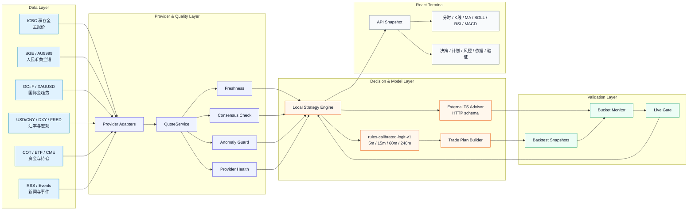
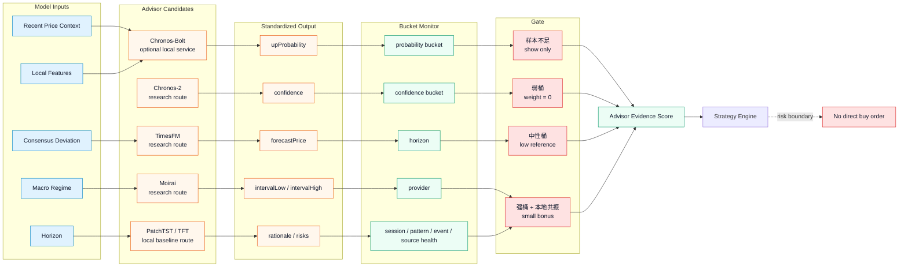
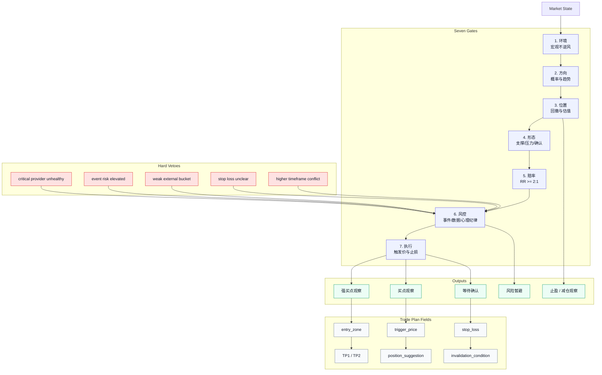
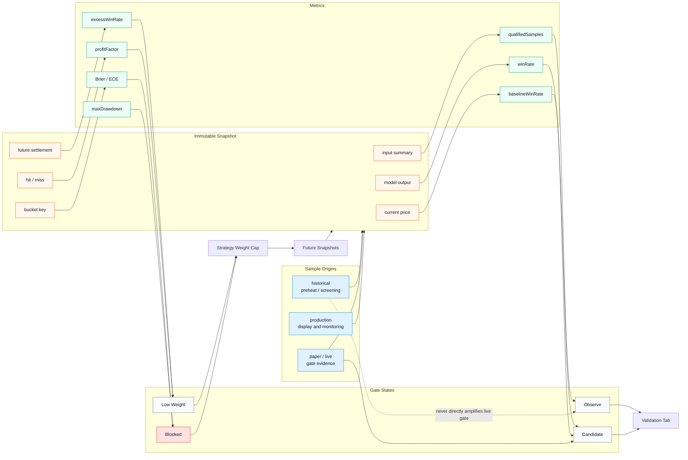
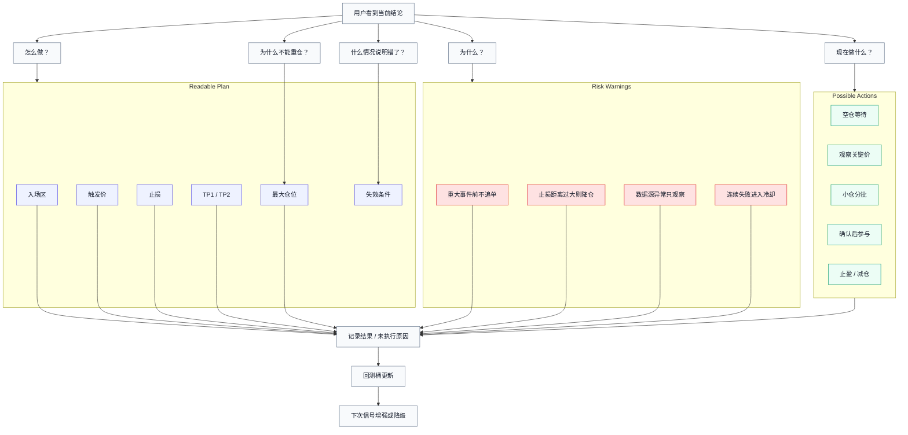

# Gold Price Monitor

Gold Price Monitor 是一个面向工银积存金和人民币黄金口径的可解释行情与买点研究终端。它把多源报价校准、金融图表、本地概率模型、可选外部时序军师、分桶回测、事件风控和交易计划放进同一条可审计证据链里，目标是帮助用户更清楚地观察黄金买卖点，而不是输出黑盒喊单。

> **Important:** 本项目仅用于行情观察、模型研究、风险提示和纸面验证，不构成投资建议、收益承诺、买入指令、卖出指令或自动交易依据。所有预测、评分、买点观察、仓位提示和专家团摘要都可能失效。

## Abstract

黄金短线交易最难的地方不是“看到一个价格”，而是判断这个价格在当前数据源健康度、人民币计价口径、国际金趋势、汇率、宏观事件、技术结构和历史同类场景中到底意味着什么。Gold Price Monitor 的设计原则是：

- **Price first, but never single-source.** 工银积存金是主报价，但必须和上金所、AU9999、国内参考价、国际金、汇率和宏观源共同校准。
- **Signals are evidence, not commands.** 本地规则模型和外部时序模型只生成证据，最终由风控、回测和交易计划门控。
- **Prediction must be calibrated.** 概率必须接受 baseline、Brier Score、Profit Factor、最大回撤和 live bucket 的检验。
- **Risk vetoes model confidence.** 数据异常、重大事件窗口、弱桶、样本不足、止损不清晰时，任何看多模型都不能直接放大买点。
- **Beginner-readable, expert-auditable.** 页面给小白用户翻译成“现在做什么、为什么、错了怎么办”，同时保留专业指标和复盘依据。

## Figure Map

本文档用 6 张 Mermaid 图描述系统核心。它们是 README 的“论文式多面板图”，不依赖外部图片资产，GitHub 可直接渲染。

| Figure | 主题 | 回答的问题 |
| --- | --- | --- |
| Fig.1 | Explainable Decision Terminal | 从行情到决策页的全链路是什么？ |
| Fig.2 | Multi-Source Calibration | 为什么不能只相信一个价格接口？ |
| Fig.3 | External Advisors and Gate | Chronos/TimesFM/Moirai 这类军师如何被约束？ |
| Fig.4 | Buy/Sell Point Logic | 买点从市场状态到交易计划如何生成？ |
| Fig.5 | Backtest and Live Gate | 模型如何避免回测自嗨？ |
| Fig.6 | Beginner Path | 小白用户如何读懂大师建议和风险边界？ |

## Fig.1 Gold Price Monitor: Explainable Decision Terminal



## What Is Implemented Today

| Layer | Current capability | Boundary |
| --- | --- | --- |
| Real-time quote | 工银积存金主报价，官方异步接口优先，公开页面 fallback | 周末或非交易时段不更新是正常现象，工作日需要看 freshness 和 provider health |
| Multi-source calibration | 上金所、AU9999、金投网国内黄金、浙商积存金、国际金、汇率、宏观和资金源框架 | 不同来源存在延迟、口径和交易时段差异，不能简单取平均 |
| Local probability model | `rules-calibrated-logit-v1`，输出 `5/15/60/240` 分钟上涨概率，主窗口为 60 分钟 | 这是规则/特征 logit 模型，不是经过大规模训练的深度学习模型 |
| Strategy engine | 多因素评分、score cap、事件风险、心理纪律、交易计划、strong/watch/avoid 分级 | 强信号仍是“观察信号”，不是交易指令 |
| External advisor | `EXTERNAL_TS_MODEL_URL` / `EXTERNAL_TS_MODEL_ENDPOINTS` HTTP 接入口，标准化外部模型输出 | 代码提供接入框架，不代表所有 provider 都已生产部署 |
| Chronos-Bolt service | `services/chronos-bolt` 可本地运行 Chronos-Bolt 推理服务 | Chronos 是可选实验军师，当前不能宣传为已验证高准确率交易模型 |
| Backtest buckets | 普通策略桶和外部模型桶，统计胜率、超额胜率、Profit Factor、Brier、MAE、回撤等 | historical 和 live 必须隔离，historical 不能直接放大生产信号 |
| Frontend terminal | 分时、K线、MA、BOLL、RSI、MACD、支撑压力、预测区间、五个决策 Tab | UI 展示辅助理解，不消除模型和数据源风险 |

## Fig.2 Multi-Source Calibration and Provider Health

```mermaid
flowchart TB
  subgraph C["Critical Sources"]
    GC["GC=F / XAUUSD"]
    DXY["DXY"]
    CNY["USD/CNY"]
    REAL["DFII10<br/>Real Yield"]
  end

  subgraph Core["Core Sources"]
    ICBC2["ICBC 积存金"]
    SGE2["SGE / AU9999"]
    COT["COT Gold Net"]
    GLD["GLD Holdings"]
    WGC["WGC ETF"]
    CME["CME Open Interest"]
  end

  subgraph S["Supporting Sources"]
    VIX["VIX"]
    CN["金投网 / 国内黄金"]
    ZS["浙商积存金"]
    CB["Central Bank Gold"]
    VOL["CME Volume"]
  end

  subgraph E["Experimental Sources"]
    RSS["News RSS"]
    BLOG["Blogger RSS"]
  end

  subgraph H["Health Scoring"]
    LAT["latencyQuality"]
    FAIL["failureStreak"]
    COOL["cooldownUntil"]
    QS["qualityScore"]
    RR["reliabilityRisk"]
  end

  subgraph O["Calibration Output"]
    MAIN["主报价可信度"]
    DEV["国内参考价偏离"]
    CONS["共识价偏离"]
    ACTION["强信号允许 / 降级 / 禁止"]
  end

  GC --> LAT
  DXY --> LAT
  CNY --> QS
  REAL --> RR
  ICBC2 --> QS
  SGE2 --> DEV
  COT --> RR
  GLD --> RR
  WGC --> RR
  CME --> RR
  VIX --> QS
  CN --> DEV
  ZS --> DEV
  CB --> QS
  VOL --> QS
  RSS --> FAIL
  BLOG --> FAIL
  LAT --> MAIN
  FAIL --> MAIN
  COOL --> MAIN
  QS --> DEV
  RR --> CONS
  MAIN --> ACTION
  DEV --> ACTION
  CONS --> ACTION

  classDef critical fill:#fee2e2,stroke:#dc2626,color:#111827
  classDef core fill:#dbeafe,stroke:#2563eb,color:#111827
  classDef support fill:#fef3c7,stroke:#d97706,color:#111827
  classDef exp fill:#f3e8ff,stroke:#7c3aed,color:#111827
  classDef health fill:#ecfdf5,stroke:#059669,color:#111827
  class GC,DXY,CNY,REAL critical
  class ICBC2,SGE2,COT,GLD,WGC,CME core
  class VIX,CN,ZS,CB,VOL support
  class RSS,BLOG exp
  class LAT,FAIL,COOL,QS,RR,MAIN,DEV,CONS,ACTION health
```



系统的核心态度是：工银价格是交易口径核心，但“准确实时”必须通过多源健康度确认。工作日交易时段内，如果主报价 stale、国内锚点偏离不可解释、critical provider 连续失败或异常跳价，强买点会被降级或禁止。

## Prediction and Advisor Models

项目不是单一“AI 预测器”，而是一个多层证据系统。

### 1. Local Strategy Engine

本地策略引擎负责把可解释因素转成买点等级、交易计划和风险提示。它会综合：

- 数据质量：官方源、fallback、staleness、异常值、国内多源共识偏离。
- 价格位置：24h 区间分位、回撤、日内高低点、短线反弹。
- 技术指标：MA、BOLL、RSI、MACD、趋势斜率、波动状态。
- K线形态：双底、双顶、支撑反弹、压力回落、锤子线、吞没、十字星。
- 多周期共振：短周期和更高周期是否冲突。
- 宏观环境：美元指数、人民币汇率、实际利率、通胀预期、VIX、ETF、COT、央行购金、CME 活跃度。
- 事件风险：CPI、FOMC、非农等窗口前后自动降权。
- 心理纪律：追高、急跌冲动、连续失败、仓位过大、止损距离不合理。
- 交易计划：入场区、触发价、失效价、止损、TP1/TP2、最大仓位和风险收益比。

### 2. Local Probability Model

本地概率模型是 `rules-calibrated-logit-v1`。它不是黑盒深度学习模型，而是把当前行情状态编码为特征后，用规则校准的 logit 形式输出多 horizon 上涨概率：

| Horizon | 用途 |
| --- | --- |
| `5m` | 判断瞬时反弹或急跌后的噪声风险 |
| `15m` | 判断短线确认和盘口延续 |
| `60m` | 当前主预测窗口，用于图表和买点观察摘要 |
| `240m` | 判断更高周期是否和短线冲突 |

典型特征包括 24h 位置、回撤、短线反弹、波动、RSI/MACD/MA20、锚点折溢价、宏观/情绪、形态、多周期和数据源健康。模型输出会进入专家团和图表预测，但不会绕过风控。

### 3. External Time-Series Advisor

外部军师是一个标准 HTTP 接入口，而不是把某个模型硬编码为真理。主服务通过下面两种配置调用外部模型：

```bash
EXTERNAL_TS_MODEL_URL=http://127.0.0.1:8000/forecast
EXTERNAL_TS_MODEL_ENDPOINTS='[{"provider":"chronos","url":"http://127.0.0.1:8000/forecast"}]'
EXTERNAL_TS_MODEL_PROVIDER=chronos
EXTERNAL_TS_MODEL_NAME=amazon/chronos-bolt-base
EXTERNAL_TS_MODEL_HORIZON_MINUTES=60
EXTERNAL_TS_MODEL_CONTEXT_POINTS=256
```

标准输出字段：

| Field | Meaning |
| --- | --- |
| `upProbability` / `downProbability` | 未来窗口方向概率 |
| `confidence` | 模型自身置信度 |
| `forecastPrice` | 预测中心价 |
| `intervalLow` / `intervalHigh` | 预测区间 |
| `rationale` | 模型解释摘要 |
| `risks` | 模型认为的主要风险 |
| `competitors` | 多 provider 对照结果 |

当前代码支持 Chronos、TimesFM、Moirai、Lag-Llama、custom provider 的统一 schema 和分桶对比，但这不等于这些模型都已经稳定生产上线。Chronos-Bolt 是当前本地可运行的示例外部军师；TimesFM、Moirai、Chronos-2、TimeGPT、PatchTST、TFT、FinGPT、FinRL 属于研究或后续扩展路线，详见 [Gold Model Upgrade Research](./docs/GOLD_MODEL_UPGRADE_RESEARCH.md)。

## Fig.3 External Advisors as Calibrated Evidence, Not Trading Authority



### Current Evidence State

当前最重要的专业结论是克制：

- Chronos-Bolt 已作为可选本地 HTTP 服务跑通，并验证过 `chronosLoaded=true`、`fallbackEnabled=false` 的真实模型模式。
- 一次 historical 验证使用 NBP 官方黄金 `PLN/g` fallback 数据，方向胜率为 `48.33%`，低于 `55.00%` 基准胜率。
- 同次验证 Profit Factor 为 `1.44`，但不能单独解读为模型有效，因为方向胜率和超额胜率不支持强结论。
- 当前 live 分桶样本仍不足，外部模型只能展示、记录和进入观察桶，不能宣传为“高准确率买点模型”。
- README 中所有外部模型相关能力都应理解为“可校准证据源”和“研究路线”，不是自动交易权威。

## Buy/Sell Point Logic

买点判断不是“跌了就买”，也不是“模型看涨就买”。系统会先判断价格是否可信，再判断位置是否有赔率，最后判断风险是否允许。

## Fig.4 From Market State to Actionable Trade Plan



### Score and Level Semantics

当前买点评分是多层规则门控，不是单一神经网络分数。它既会加分，也会设置分数上限。

| Signal | Meaning | Typical constraints |
| --- | --- | --- |
| `strong` | 高质量买点观察 | 分数通常需要 `>=72`，交易计划置信度不能低，且不能被事件/数据/弱桶否决 |
| `watch` | 买点观察 | 分数通常需要 `>=45`，适合观察关键价位和确认条件 |
| `avoid` / low score | 风险暂避 | 数据异常、事件风险、追高、弱桶、止损不清晰或多周期冲突时触发 |

外部模型在这里不是主裁判。它只在“样本足够、分桶表现不弱、与本地规则共振”时给低权重证据；如果样本不足或命中弱桶，权重为 0。

## Backtest, Bucket Gate and Model Validation

专业交易系统最容易犯的错是用漂亮回测安慰自己。因此项目把验证设计成“分桶、隔离、基准对照、概率校准”的闭环。

## Fig.5 Historical Backtest and Live Gate Feedback Loop



### Bucket Metrics

外部模型和本地策略都会被拆成可复盘桶。常见维度包括：

| Bucket dimension | Examples |
| --- | --- |
| Signal | `strong`、`watch`、score bands |
| Model | provider、概率区间、置信度区间、本地共振 |
| Market state | session、pattern、macro、valuation、confluence |
| Risk state | event risk、source health、data quality |
| Horizon | `5m`、`15m`、`60m`、`240m` |

关键指标包括 `qualifiedSamples`、`winRate`、`baselineWinRate`、`excessWinRate`、`averageReturn`、`profitFactor`、`maxDrawdown`、`MAE/MFE`、`Brier Score`、`calibrationError` 和 `reliability`。

### External Model Gate

| Gate state | Rule | Strategy effect |
| --- | --- | --- |
| Insufficient | 样本不足 | 只展示，不加权 |
| Weak | `reliability < 45`、`excessWinRate < 0`、`profitFactor < 1.05` 或 `Brier > 0.26` | 权重为 0 |
| Neutral | 样本足够但优势不明显 | 最多低权重参考 |
| Strong | `qualifiedSamples >= 20`、`reliability >= 55`、`excessWinRate >= 0`、`profitFactor >= 1.05`，且模型与本地规则同向 | 允许小幅加分，但不能覆盖风控 |

## Fig.6 Beginner-Friendly Path: Signal to Safe Action Plan



## UI Workflow

页面不是为了让用户盯一个分数冲动交易，而是把复杂系统翻译成可复核的操作语言。

| Tab | What it explains | Beginner translation |
| --- | --- | --- |
| 决策 | 当前是 strong、watch、wait 还是 avoid | 现在要不要进入观察区 |
| 计划 | 入场区、触发价、止损、止盈、仓位 | 如果参与，错了在哪里认错 |
| 风控 | 事件风险、数据质量、心理纪律 | 为什么不能冲动追单或重仓 |
| 依据 | 宏观、形态、技术、多源校准、专家分歧 | 这个判断靠什么证据 |
| 验证 | 回测桶、外部模型表现、弱桶提示 | 这个信号历史同类场景是否可靠 |

## Project Structure

```text
.
├── api/                         # Vercel serverless API
├── apps/
│   ├── server/                  # Express + TypeScript backend
│   └── web/                     # React + Vite frontend
├── docs/                        # Architecture, model card, research and logs
├── scripts/                     # Local AI, Chronos verification and historical validation
├── services/
│   └── chronos-bolt/            # Optional FastAPI Chronos-Bolt inference service
├── .env.production.example      # Production env template with placeholders only
├── PRODUCTION_DEPLOYMENT.md     # Deployment guide
└── render.yaml                  # Render blueprint
```

## Quick Start

```bash
npm install
npm run dev:server
npm run dev:web
```

Default local endpoints:

```text
Web: http://localhost:5173
API: http://localhost:8787
```

Production mode:

```bash
npm run build
npm start
```

## Optional Chronos-Bolt Local Advisor

Run the full local stack with the optional Chronos-Bolt service:

```bash
npm run dev:ai
```

This starts the Python service under `services/chronos-bolt`, waits for `/health`, configures the main server with `EXTERNAL_TS_MODEL_URL`, and launches the web app. The service is useful for research and paper/live evidence collection, but it does not make Chronos a validated trade amplifier by itself.

Verify the service:

```bash
CHRONOS_SERVICE_URL=http://127.0.0.1:8000 \
CHRONOS_SERVICE_TOKEN=local-chronos-token \
npm run verify:chronos
```

## Historical Validation

Run offline historical validation:

```bash
npm run validate:historical
```

The script tries Yahoo `GC=F` first and can fall back to NBP official gold data when network access is limited. NBP `PLN/g` is not the same trading口径 as ICBC accumulation gold `CNY/g`; results from that fallback are useful for pipeline preheating and sanity checks, not for claiming ICBC live accuracy.

## Scripts

```bash
npm run dev:web
npm run dev:server
npm run dev:ai
npm run chronos:local
npm run verify:chronos
npm run validate:historical
npm run test --workspace server
npm run lint --workspace web
npm run build
```

## Deployment

Supported deployment modes:

| Mode | Notes |
| --- | --- |
| Node/Docker single instance | Good for local or private server deployment |
| Vercel serverless API | Requires persistent storage choice for stable historical samples |
| Render blueprint | Includes service-oriented deployment path |
| SQLite | Good for single-instance persistence |
| Postgres HTTP SQL gateway | Better for serverless and multi-instance environments |
| External model service | Chronos-Bolt or other provider runs as a separate HTTP service |

See [PRODUCTION_DEPLOYMENT.md](./PRODUCTION_DEPLOYMENT.md).

## Research Roadmap

The roadmap is intentionally conservative. New models should first enter observe/paper mode, accumulate snapshots, pass bucket validation, and only then receive limited strategy weight.

| Stage | Candidate | Role |
| --- | --- | --- |
| 0 | Better ICBC/AU9999 history | Fix data口径 before trusting model results |
| 1 | Chronos-2 covariates | Test whether multivariate and covariate-aware forecasting improves RMB gold signals |
| 2 | TimesFM | Independent zero-shot foundation-model advisor |
| 3 | NeuralForecast with PatchTST/TFT/NHITS | Local trainable baseline with walk-forward validation |
| 4 | FinGPT-style text features | Convert news/events into timestamped features, not direct trade decisions |
| 5 | FinRL-style execution simulator | Study position sizing and execution only after prediction edge is validated |

## References

Core project docs:

- [Architecture](./docs/ARCHITECTURE.md)
- [Model Card](./docs/MODEL_CARD.md)
- [External Model Iteration Log](./docs/EXTERNAL_MODEL_ITERATION_LOG.md)
- [Gold Model Upgrade Research](./docs/GOLD_MODEL_UPGRADE_RESEARCH.md)
- [Data Source Provider Audit](./docs/DATA_SOURCE_PROVIDER_AUDIT.md)
- [Chronos-Bolt Service](./services/chronos-bolt/README.md)

External model references:

- [Chronos: Learning the language of time series](https://www.amazon.science/publications/chronos-learning-the-language-of-time-series)
- [Chronos repository](https://github.com/amazon-science/chronos-forecasting)
- [TimesFM repository](https://github.com/google-research/timesfm)
- [Temporal Fusion Transformers](https://arxiv.org/abs/1912.09363)
- [PatchTST](https://arxiv.org/abs/2211.14730)
- [Moirai](https://arxiv.org/abs/2402.02592)
- [NeuralForecast](https://github.com/Nixtla/neuralforecast)
- [FinRL](https://arxiv.org/abs/2111.09395)
- [FinGPT](https://arxiv.org/abs/2306.06031)

## Privacy and Security

- 不提交真实 `.env`、token、API key、数据库连接串、Cookie、个人交易记录或本地数据库。
- 不提交 `services/chronos-bolt/.venv`、`reports/`、`apps/server/data`。
- `.env.production.example` 只保留占位符。
- 外部模型服务只应接收公开行情和匿名化特征，不应接收个人账户、银行登录态、真实持仓或交易密码。
- 本项目不保存银行登录态，不接触交易账户，不自动下单。

## License

MIT. See [LICENSE](./LICENSE).

## Disclaimer

本项目仅用于行情观察、模型研究和风险提示。黄金、贵金属和相关金融资产价格会受到宏观政策、汇率、利率、流动性、地缘事件、交易时段、数据源延迟和市场情绪影响。所有预测、回测、胜率、买点观察、仓位提示、交易计划和专家团输出都可能失效，不构成投资建议、收益承诺、买入指令、卖出指令、自动交易依据或风险兜底。使用者应自行判断并承担投资风险。
