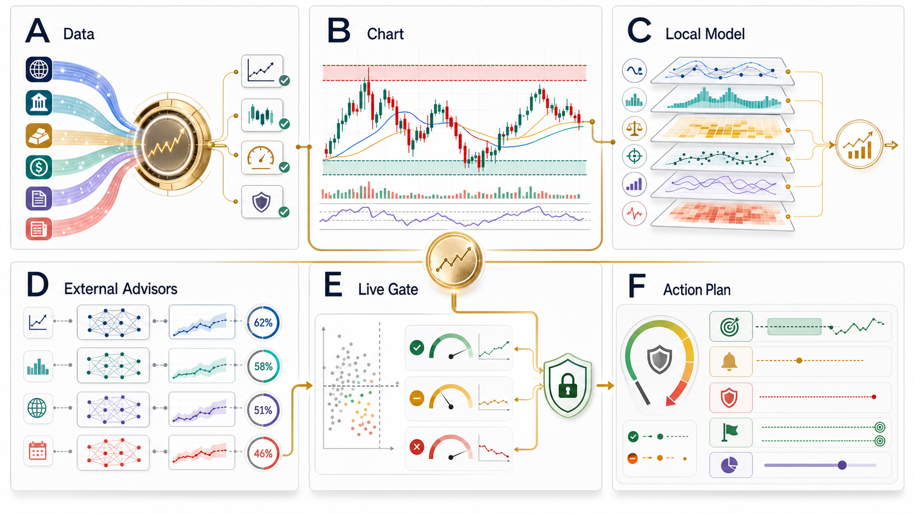
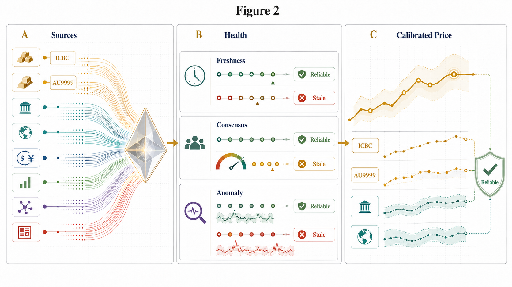
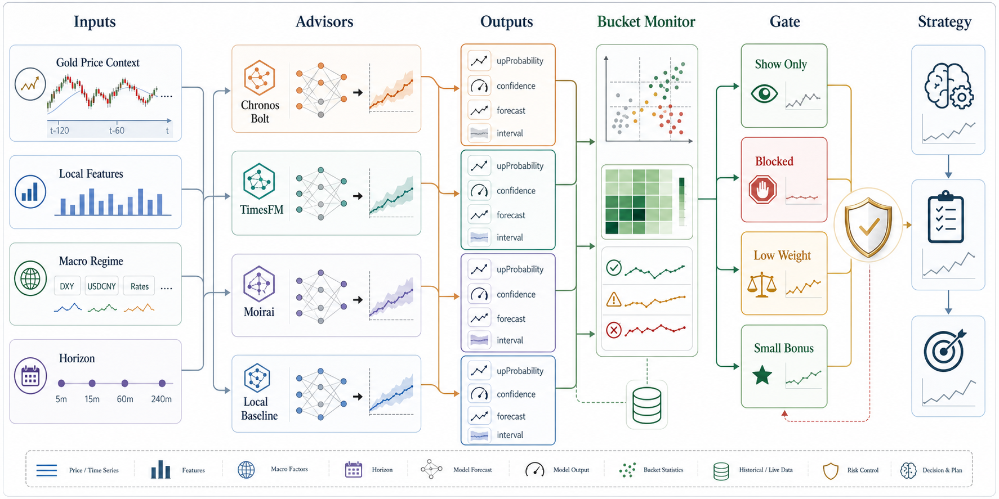
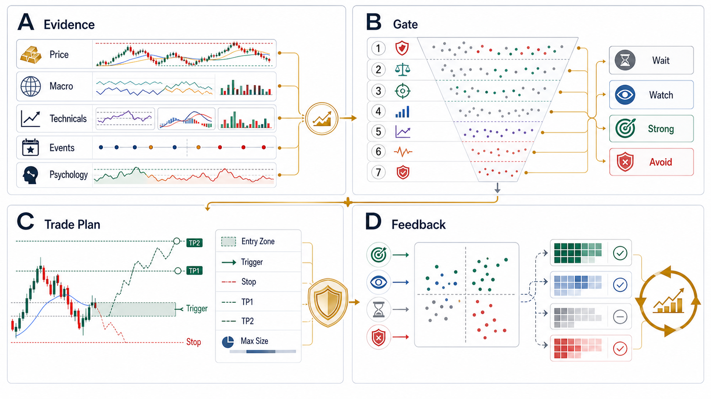

# Gold Price Monitor

Gold Price Monitor 是一个面向 **工银积存金 / 人民币黄金口径** 的可解释行情、预测军师、买点观察和风险决策终端。它不是一个“AI 喊单器”，而是把实时行情、多源校准、本地概率模型、可选外部时序模型、分桶回测、事件风控和交易计划压到同一条可审计证据链里。

> **Risk boundary:** 本项目仅用于行情观察、模型研究、纸面验证和风险提示，不构成投资建议、收益承诺、买入指令、卖出指令或自动交易依据。所有预测、评分、买点观察、仓位提示和专家团摘要都可能失效。

## Graphical Abstract



**Fig. 1 | System-level graphical abstract.** 系统从多源黄金数据进入校准核心，再经过专业图表、本地模型、外部时序军师、live gate 和风险优先交易计划，最终给用户展示“观察 / 等待 / 强观察 / 暂避”等可解释结论。

## Why This Project Exists

黄金短线交易里，“价格是多少”只是最浅的一层。真正困难的是：

- 这个工银积存金报价是否新鲜、是否和上金所 / AU9999 / 国内参考价一致？
- 国际金、美元指数、人民币汇率、实际利率和事件窗口是否支持这个方向？
- K线、分时、支撑压力、RSI、MACD 和多周期是否共振？
- 当前看起来像买点，历史同类场景真的有优势吗？
- 模型看多时，是可验证概率，还是只是漂亮但未校准的预测？
- 如果判断错了，止损、失效价和仓位边界在哪里？

Gold Price Monitor 的目标就是把这些问题变成一套清晰、可复盘、可降级的决策系统。

## Current Capability Matrix

| Area | 当前已经实现 | 不能夸大的边界 |
| --- | --- | --- |
| 主行情 | 工银积存金主报价，官方异步接口优先，公开页面 fallback | 周末和非交易时段不更新正常；工作日必须看 freshness |
| 多源校准 | 上金所 / AU9999、金投网、浙商积存金、国际金、汇率和宏观源框架 | 不同源有延迟和口径差异，不能粗暴平均 |
| 本地概率模型 | `rules-calibrated-logit-triple-barrier-v1`，输出 `5m / 15m / 60m / 240m` TP1 先达概率 | 这是规则校准 logit + 路径标签，不是深度学习训练模型 |
| 买点评分 | 技术、形态、估值、宏观、事件、心理纪律、交易计划和回测共同影响分数与上限 | 分数不是买入指令 |
| 知识库规则包 | `gold-kb-rule-pack-v1`，审校趋势结构、形态位置、假突破、事件阶段和赔率纪律 | 规则包用于拦截误判，不保证 100% 正确 |
| 外部军师 | `EXTERNAL_TS_MODEL_URL` / `EXTERNAL_TS_MODEL_ENDPOINTS` HTTP 接口，支持多 provider schema | 接口支持不等于所有 provider 已生产稳定运行 |
| Chronos-Bolt | 可选本地 Chronos-Bolt 推理服务，已做过真实模型联调 | 当前不能宣传为已验证高准确率交易模型 |
| 回测 gate | 策略桶和外部模型桶，统计胜率、超额胜率、PF、Brier、MAE、回撤 | historical 不能直接污染 live gate |
| 前端终端 | 分时、K线、MA、BOLL、RSI、MACD、预测区间、五个决策 Tab | UI 是解释层，不消除投资风险 |

## Data Calibration



**Fig. 2 | Multi-source calibration and provider health.** 系统不会只相信单一报价源。工银积存金是主交易口径，但强信号必须经过 freshness、anomaly、consensus、provider health 等检查；一旦关键源 stale、异常跳价或共识偏离不可解释，买点会被降级或拦截。

### Data Source Hierarchy

| Tier | Examples | Role in decision |
| --- | --- | --- |
| Primary trading口径 | ICBC accumulation gold | 页面主价格和交易口径 |
| RMB gold anchors | SGE / AU9999 / domestic references | 校准人民币黄金相对位置 |
| Global gold drivers | GC=F / XAUUSD | 判断国际黄金主趋势 |
| FX and macro | USD/CNY, DXY, real yield, inflation, VIX | 判断人民币计价黄金是否有宏观顺风/逆风 |
| Positioning and flow | COT, GLD, WGC ETF, CME OI/volume | 判断资金拥挤、流入流出和趋势参与度 |
| Text/event sources | RSS, blogger feeds, CPI/FOMC/NFP windows | 只做低权重解释和事件风险，不直接喊单 |

## Model Stack

系统分为 5 层，越往下越接近风控，越不能被模型置信度覆盖。

| Layer | Name | What it does |
| --- | --- | --- |
| 1 | Data Quality Guard | 判断报价是否新鲜、是否异常、是否和参考源偏离过大 |
| 2 | Local Strategy Engine | 组合技术、形态、估值、宏观、事件和心理纪律 |
| 3 | Local Probability Model | 用规则校准 logit 输出多周期上涨概率 |
| 4 | External TS Advisor | 接入 Chronos / TimesFM / Moirai / custom HTTP provider 的预测证据 |
| 5 | Bucket Gate & Trade Plan | 用同类样本、Brier、PF、回撤和止损计划决定是否允许加权 |

### Local Probability Model

当前本地概率模型是 `rules-calibrated-logit-triple-barrier-v1`，不是黑盒神经网络。它从当前行情提取特征，并输出不同窗口的 **TP1 先达概率**：也就是在给定时间窗内，价格是否先触及目标收益而不是先触及止损。

| Feature family | Examples |
| --- | --- |
| Price location | 24h 区间位置、回撤、日内高低点、短线反弹 |
| Technicals | MA20、RSI、MACD、波动、均线斜率 |
| Structure | 支撑压力、双底/双顶、锤子线、吞没、十字星 |
| Cross-market | AU9999 锚点、国内参考价、国际金、人民币汇率 |
| Macro | 美元指数、实际利率、通胀预期、VIX、ETF、COT、央行购金 |
| Risk | 数据质量、事件窗口、多周期冲突、心理纪律 |
| Knowledge Rules | 趋势结构、形态位置、假突破风险、回撤质量、支撑阻力质量、宏观顺逆风 |

### Knowledge Rule Pack

`gold-kb-rule-pack-v1` 把知识库里的交易原则变成可审计 gate。它不会“替用户下单”，而是专门防止常见误判：候选双底没确认就追、箱体中位硬买、事件第一波冲动追单、假突破高位接力、赔率不足还强提醒。

| Rule | What it checks | If it fails |
| --- | --- | --- |
| `kb:trend-structure` | 均线、MACD、短线结构和多周期方向 | 趋势未确认时降级 |
| `kb:pattern-location` | 形态是否确认、是否在高位或箱体中位 | 候选形态只允许观察 |
| `kb:false-breakout` | 高位、波动扩张、未回踩确认 | 高风险时阻止强提醒 |
| `kb:event-phase` | CPI/FOMC/非农等事件阶段 | 事件第一波不追单 |
| `kb:risk-reward-discipline` | 交易计划赔率是否至少 2:1 | 赔率不足时拦截 |

### External Advisor Model

外部军师是标准 HTTP 接口，不是不可质疑的交易权威。

```bash
EXTERNAL_TS_MODEL_URL=http://127.0.0.1:8000/forecast
EXTERNAL_TS_MODEL_ENDPOINTS='[{"provider":"chronos","url":"http://127.0.0.1:8000/forecast"}]'
EXTERNAL_TS_MODEL_PROVIDER=chronos
EXTERNAL_TS_MODEL_NAME=amazon/chronos-bolt-base
EXTERNAL_TS_MODEL_HORIZON_MINUTES=60
EXTERNAL_TS_MODEL_CONTEXT_POINTS=256
```

统一输出：

| Output | Meaning |
| --- | --- |
| `upProbability` / `downProbability` | 未来窗口方向概率 |
| `confidence` | 模型置信度 |
| `forecastPrice` | 预测中心价 |
| `intervalLow` / `intervalHigh` | 概率区间 |
| `rationale` / `risks` | 模型解释与风险 |
| `competitors` | 多 provider 对照结果 |

## External Advisor Gate



**Fig. 3 | External advisors are calibrated evidence, not trading authority.** Chronos-Bolt、TimesFM、Moirai、PatchTST/TFT 等都必须进入统一输出 schema，再按 provider、horizon、概率桶、置信度桶、session、pattern、event risk、source health 做分桶检验。模型只有在 live 同类场景证明自己不弱，且与本地规则共振时，才允许低权重加分。

### Gate Policy

| Gate state | Condition | Strategy effect |
| --- | --- | --- |
| Show only | 样本不足，或 provider 刚接入 | 展示、记录，不加权 |
| Blocked | 弱桶、负超额胜率、PF 不达标、Brier 偏差过高 | 权重为 0 |
| Low Weight | 表现中性，但没有明显反证 | 只作为低权重参考 |
| Small Bonus | 样本充足、同类桶表现稳定、本地规则同向 | 允许小幅加分，但不能覆盖风控 |

当前最重要的证据状态：

- Chronos-Bolt 已作为可选本地 HTTP 服务跑通，实验记录显示 `chronosLoaded=true`、`fallbackEnabled=false`。
- 一次 historical fallback 验证使用 NBP 官方黄金 `PLN/g`，方向胜率 `48.33%`，低于 `55.00%` 基准。
- Profit Factor `1.44` 不能单独包装成“模型有效”，因为方向胜率和超额胜率不支持强结论。
- live 分桶样本仍不足，外部模型当前定位是观察军师和候选概率特征源，不是交易放大器。

## Buy/Sell Point Logic



**Fig. 4 | Risk-first buy/sell point decision engine.** 买点不是“跌了就买”，也不是“模型看涨就买”。系统先看证据栈，再经过七层 gate，最后生成可执行但可否决的交易计划。任何一层触发硬风险，结论都会从 strong/watch 降为 wait/avoid。

### Seven Gates

| Gate | Question | Failure behavior |
| --- | --- | --- |
| 1. Data | 报价是否新鲜、可信、没有异常跳价？ | 降级或只观察 |
| 2. Direction | 本地概率、趋势和外部军师是否同向？ | 等待确认 |
| 3. Position | 是否处在合理回撤、估值或支撑位置？ | 不追高 |
| 4. Structure | 支撑/压力/形态是否给出确认和失效价？ | 不做无止损计划 |
| 5. Reward/Risk | 入场到止损/止盈的赔率是否合理？ | 降仓或不参与 |
| 6. Event | CPI、FOMC、非农等窗口是否过热？ | 暂避 |
| 7. Discipline | 是否存在追高、急跌冲动、连续失败？ | 冷却或轻仓 |

### Signal Language

| Signal | What it means | User-facing interpretation |
| --- | --- | --- |
| `strong` | 多层证据共振，风控未否决，交易计划清楚 | 强买点观察，不等于无脑买入 |
| `watch` | 出现买点条件，但仍缺确认或样本不足 | 盯关键价，等待触发 |
| `wait` | 有线索但赔率、数据或周期不够好 | 不急，等更便宜或更明确 |
| `avoid` | 数据、事件、形态或心理纪律风险过高 | 暂避，先保护本金 |

## Beginner Translation

页面最终要把复杂模型翻译成 5 个小白能读懂的问题：

1. **现在做什么？** 等待、观察、小仓、确认后参与，还是暂避。
2. **为什么？** 哪些证据支持，哪些证据反对。
3. **怎么做？** 入场区、触发价、止损、TP1/TP2、最大仓位。
4. **错了怎么办？** 跌破/突破哪个价位说明形态或计划失效。
5. **为什么不能重仓？** 数据质量、事件窗口、弱桶、回撤、心理纪律是否限制仓位。

## Validation Methodology

| Metric | Why it matters |
| --- | --- |
| `qualifiedSamples` | 样本太少时禁止过度解释 |
| `winRate` | 看方向命中率 |
| `baselineWinRate` | 防止把自然上涨行情误认为模型能力 |
| `excessWinRate` | 判断是否相对基准有增益 |
| `profitFactor` | 判断盈亏结构，而不只看胜率 |
| `Brier Score` / calibration | 判断概率是否可信 |
| `MAE/MFE` | 判断入场后最大不利/有利波动 |
| `maxDrawdown` | 判断最坏路径风险 |
| `sourceHealth` | 判断数据源故障是否污染信号 |

### Triple-Barrier Labels

回测现在不再只问“未来某个点涨没涨”，而是记录真实交易路径：

| Outcome | Meaning |
| --- | --- |
| `tp1_hit` | 先触及 TP1，记为正样本 |
| `stop_loss_hit` | 先触及止损，记为失败样本 |
| `no_touch` | 时间窗结束仍未触及 TP1 或止损 |
| `timeout` | 数据路径不足，不能完整评价 |

这让“胜率”更接近真实交易体验：同样是最终上涨，如果中途先打止损，就不能算成功。

### Historical, Paper, Live and Production Separation

| Sample origin | Use | Rule |
| --- | --- | --- |
| `historical` | 预热、筛选、离线 sanity check | 不能直接放大 production 信号 |
| `paper/live` | 真实运行中的纸面样本 | 可进入 live gate |
| `production` | 前端展示和监控 | 必须受风控与 gate 约束 |

## Quick Start

```bash
npm install
npm run dev:server
npm run dev:web
```

Default local endpoints:

```text
Web: http://localhost:5173
API: http://localhost:8787
```

Production mode:

```bash
npm run build
npm start
```

## Optional Chronos-Bolt Local Advisor

```bash
npm run dev:ai
```

This starts the optional Python Chronos-Bolt service, waits for `/health`, configures the main server with `EXTERNAL_TS_MODEL_URL`, and launches the web app. It is useful for research and paper/live evidence collection, but it does not make Chronos a validated trade amplifier by itself.

Verify Chronos:

```bash
CHRONOS_SERVICE_URL=http://127.0.0.1:8000 \
CHRONOS_SERVICE_TOKEN=local-chronos-token \
npm run verify:chronos
```

## Historical Validation

```bash
npm run validate:historical
```

The script tries Yahoo `GC=F` first and can fall back to NBP official gold data when network access is limited. NBP `PLN/g` is not the same口径 as ICBC accumulation gold `CNY/g`; fallback results are useful for pipeline preheating and sanity checks, not for claiming ICBC live accuracy.

## Project Structure

```text
.
├── api/                         # Vercel serverless API
├── apps/
│   ├── server/                  # Express + TypeScript backend
│   └── web/                     # React + Vite frontend
├── docs/
│   ├── assets/figures/          # Publication-style README figures
│   └── *.md                     # Architecture, model card, research and logs
├── scripts/                     # Chronos verification and historical validation
├── services/
│   └── chronos-bolt/            # Optional FastAPI Chronos-Bolt inference service
├── .env.production.example
├── PRODUCTION_DEPLOYMENT.md
└── render.yaml
```

## Scripts

```bash
npm run dev:web
npm run dev:server
npm run dev:ai
npm run chronos:local
npm run verify:chronos
npm run validate:historical
npm run test --workspace server
npm run lint --workspace web
npm run build
```

## Deployment

| Mode | Notes |
| --- | --- |
| Node/Docker single instance | Good for local or private server deployment |
| Vercel serverless API | Needs persistent storage for stable historical samples |
| Render blueprint | Service-oriented deployment path |
| SQLite | Single-instance persistence |
| Postgres HTTP SQL gateway | Serverless or multi-instance persistence |
| External model service | Chronos-Bolt or other provider runs as separate HTTP service |

See [PRODUCTION_DEPLOYMENT.md](./PRODUCTION_DEPLOYMENT.md).

## Research Roadmap

| Stage | Candidate | Role |
| --- | --- | --- |
| 0 | Better ICBC/AU9999 history | Fix data口径 before trusting model results |
| 1 | Chronos-2 covariates | Test multivariate and covariate-aware forecasting |
| 2 | TimesFM | Independent zero-shot foundation-model advisor |
| 3 | NeuralForecast with PatchTST/TFT/NHITS | Local trainable baseline with walk-forward validation |
| 4 | FinGPT-style text features | Convert news/events into timestamped features, not direct trade decisions |
| 5 | FinRL-style execution simulator | Study position sizing after prediction edge is validated |

## References

Project docs:

- [Architecture](./docs/ARCHITECTURE.md)
- [Model Card](./docs/MODEL_CARD.md)
- [External Model Iteration Log](./docs/EXTERNAL_MODEL_ITERATION_LOG.md)
- [Gold Model Upgrade Research](./docs/GOLD_MODEL_UPGRADE_RESEARCH.md)
- [Data Source Provider Audit](./docs/DATA_SOURCE_PROVIDER_AUDIT.md)
- [Chronos-Bolt Service](./services/chronos-bolt/README.md)

Model references:

- [Chronos: Learning the language of time series](https://www.amazon.science/publications/chronos-learning-the-language-of-time-series)
- [Chronos repository](https://github.com/amazon-science/chronos-forecasting)
- [TimesFM repository](https://github.com/google-research/timesfm)
- [Temporal Fusion Transformers](https://arxiv.org/abs/1912.09363)
- [PatchTST](https://arxiv.org/abs/2211.14730)
- [Moirai](https://arxiv.org/abs/2402.02592)
- [NeuralForecast](https://github.com/Nixtla/neuralforecast)
- [FinRL](https://arxiv.org/abs/2111.09395)
- [FinGPT](https://arxiv.org/abs/2306.06031)

## Privacy and Security

- 不提交真实 `.env`、token、API key、数据库连接串、Cookie、个人交易记录或本地数据库。
- 不提交 `services/chronos-bolt/.venv`、`reports/`、`apps/server/data`。
- `.env.production.example` 只保留占位符。
- 外部模型服务只应接收公开行情和匿名化特征，不应接收个人账户、银行登录态、真实持仓或交易密码。
- 本项目不保存银行登录态，不接触交易账户，不自动下单。

## License

MIT. See [LICENSE](./LICENSE).

## Disclaimer

本项目仅用于行情观察、模型研究和风险提示。黄金、贵金属和相关金融资产价格会受到宏观政策、汇率、利率、流动性、地缘事件、交易时段、数据源延迟和市场情绪影响。所有预测、回测、胜率、买点观察、仓位提示、交易计划和专家团输出都可能失效，不构成投资建议、收益承诺、买入指令、卖出指令、自动交易依据或风险兜底。使用者应自行判断并承担投资风险。
