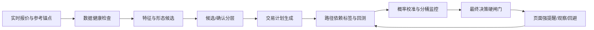

# 黄金买卖决策准确率升级计划

日期：2026-05-18

目标不是让页面更“敢说”，而是让系统更少误报、更会等待、更能解释。最终页面只在数据、形态、赔率、宏观、样本验证和交易纪律同时过关时，才允许出现强提醒。

## 1. 当前瓶颈

现有系统已经具备多源报价、K 线形态、概率模型、外部时序军师、交易计划和风控展示，但准确率上限主要受以下问题限制：

- 形态识别偏“候选即信号”。疑似双底、支撑反弹、阻力回落等信号过去容易在未站上颈线、未离开支撑、未确认失败价之前进入买点评分。
- 评分仍以人工规则为主。低位、回撤、RSI、MACD、锚点折溢价、专家团观点都有加权，但权重没有完全来自长期训练和样本外验证。
- 标签定义过粗。过去更多看未来价格是否上涨，真正交易里更重要的是是否触发入场、是否先止损、是否到 TP1、最大不利波动是否可承受。
- 概率尚未完全校准。页面分数更像信号强度，不应被用户理解成严格的未来上涨概率。
- 强提醒门槛不够硬。强信号应该由多个硬闸门共同批准，而不是单纯由总分决定。

## 2. 总体架构

核心原则：

- 先降误报，再追求捕捉率。
- 所有买点建议必须能落到入场区、触发价、止损、TP1/TP2、赔率和失效条件。
- 每一次信号都要变成训练样本，未来用真实结果反向修正模型。
- 强提醒只在硬闸门全通过时出现，宁可错过，也不在证据不足时诱导追单。

## 3. 决策标签体系

下一阶段要把样本从“涨/跌”升级为“交易是否成功”：

- `buy_watch`：触发入场后，先到 TP1 或至少 +0.5R 为正样本；先到止损为负样本；未触发为中性样本。
- `double_bottom`：站上颈线后先达到形态目标为正样本；跌破右底失效价为负样本。
- `double_top`：跌破颈线并先到目标为正样本；突破右顶失效价为负样本。
- `support_rebound`：触达支撑后确认反弹并达到 +0.5R/TP1 为正样本；有效跌破支撑为负样本。
- `risk_observation`：风险提示后避免明显回撤为正样本；提示后继续上涨且未触发风险为误杀样本。

这些标签会引入 triple-barrier / meta-labeling 思路：同时看止盈、止损和最长持有时间，避免只看终点涨跌。

## 4. 模型升级路线

### Phase 0：立即降低误报

已开始执行：

- 给 `PatternSignal` 增加 `confirmationStatus` 和 `confirmationReason`。
- 双底/双顶拆为候选与确认，未过颈线只能低权重观察。
- 支撑反弹必须满足“跌入支撑 + 从支撑弹开 + 最新动量不继续下破”。
- 阻力回落必须满足“涨入阻力 + 从阻力回落 + 最新动量不继续突破”。
- 策略层把候选看多形态降为最多小幅加分，并加入风险提示。
- 新增最终决策硬闸门，强提醒必须通过实时数据、锚点一致、多源覆盖、事件风控、赔率、交易纪律、周期共振、形态确认、历史验证、外部模型军师。

### Phase 1：训练样本与持久化

要新增 `DecisionSample` 和 `DecisionLabel`：

- 记录每个时间点的价格、锚点、宏观因子、形态、技术指标、专家团输出、交易计划和最终决策。
- 在 5/15/60/240 分钟后补标签：是否触发、先止损还是先止盈、最大不利波动、最大有利波动、净收益。
- 存储层需要稳定数据库，避免 Serverless 冷启动导致历史断裂。

### Phase 2：walk-forward 与概率校准

验证方式必须从普通回测升级为 walk-forward：

- 每天只用过去数据训练或调参，验证未来数据。
- 分桶统计不同形态、时段、宏观 regime、数据源质量、赔率区间下的胜率。
- 用 Brier score、可靠性曲线、Platt scaling 或 isotonic regression 校准概率。
- 页面展示“同类历史样本量、胜率、平均收益、最大回撤、可信度”，而不是只展示一个漂亮分数。

### Phase 3：军师模型集成

外部时序基础模型只做“低权重候选军师”，不能单独拍板：

- Chronos / TimesFM / Moirai / Lag-Llama 作为多模型候选。
- 本地规则模型负责风控和可解释性。
- 回测分桶负责给每个军师动态权重。
- 如果某个军师在当前分桶历史表现弱，必须自动禁用或降权。

### Phase 4：最终决策产品化

页面应从“分数展示”升级为“决策驾驶舱”：

- 顶部只给一句核心动作：回避、等待、观察、轻仓试探、确认后分批、止盈/降仓。
- 强提醒必须附带为什么强、止损在哪里、错了怎么退出。
- 候选信号必须清楚标注“未确认”，防止小白把观察当买入。
- 每次模型失败后展示归因：追高、假突破、事件冲击、数据异常、形态失效、止损过紧等。

## 5. worktree / agent 分派

第一批并行审计已完成：

- 实现审计 agent：定位形态候选过早加权、人工规则权重、标签过粗等问题。
- 数据验证 agent：设计 `DecisionSample`、路径依赖标签、walk-forward、校准指标。
- 产品决策 agent：设计最终决策硬闸门和小白可理解的动作表达。

后续开发建议分为五条 worktree：

- `worktree/pattern-confirmation`：负责形态候选/确认、支撑阻力过滤、形态单测。
- `worktree/decision-labels`：负责样本 schema、路径依赖标签、训练样本补标任务。
- `worktree/walk-forward-calibration`：负责分桶回测、可靠性曲线、概率校准、Brier/收益指标。
- `worktree/final-decision-gates`：负责最终决策对象、强提醒闸门、前端决策卡。
- `worktree/model-advisor-ensemble`：负责外部军师多模型接入、动态权重、弱桶拦截。

## 6. 验收标准

- 强提醒触发必须满足所有硬闸门，不允许仅靠总分。
- 未确认双底、疑似支撑反弹不能单独制造强买点。
- 每个买点都必须有触发价、止损、TP1、赔率和失效说明。
- 页面能解释当前是“为什么能买/为什么不能买/还差什么确认”。
- 回测指标必须至少包含样本量、胜率、平均收益、最大回撤、Brier score 和分桶表现。
- 样本不足时，系统必须明确降级，而不是伪装成高置信预测。

## 7. 研究参考

- [scikit-learn probability calibration](https://scikit-learn.org/stable/modules/calibration.html)：校准曲线、Brier score、sigmoid/isotonic calibration。
- [mlfinpy labeling](https://mlfinpy.readthedocs.io/en/latest/Labelling.html)：triple-barrier 与 meta-labeling 风格的路径依赖标签。
- [Temporal Fusion Transformer](https://arxiv.org/abs/1912.09363)：可解释多步时序预测结构。
- [PatchTST](https://arxiv.org/abs/2211.14730)：基于 patch 的 Transformer 时间序列预测。
- [Chronos](https://github.com/amazon-science/chronos-forecasting)：预训练时间序列基础模型，可作为外部军师候选之一。
